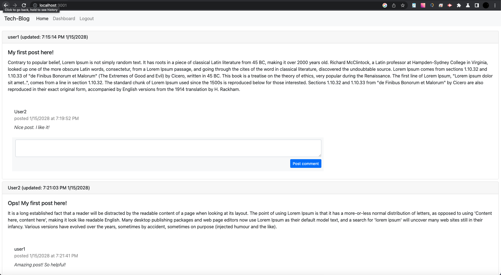
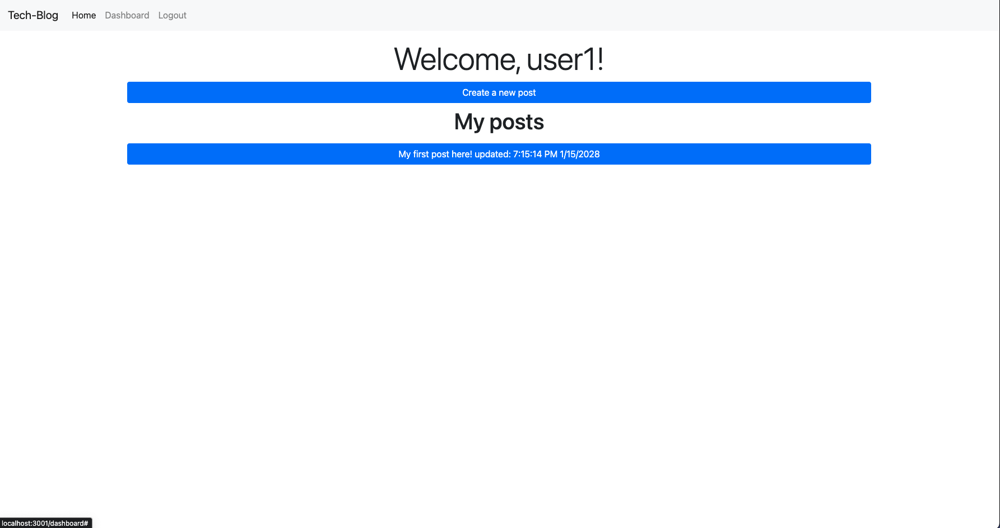
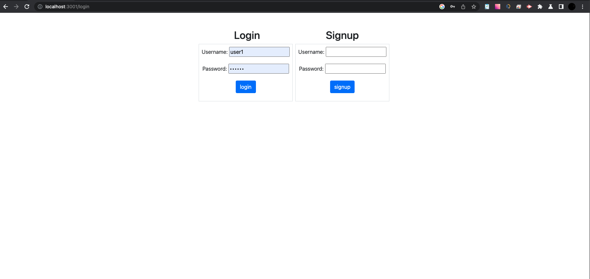

# Tech Blog (MVC Challenge). 

## Description
  
Tech blog is a CMS-style blog site similar to a Wordpress site, where developers can publish their blog posts and comment on other developers’ posts as well.

## Table of Contents
- [Installation](#installation)
- [Usage](#usage)
- [Contributing](#contributing)
- [Test instructions](#test-instructions)
- [License](#tlicense)
- [Questions](#questions)

## Installation
For the application to work correctly, you need to download and install Node.js and npm.  Detailed instructions can be found by clicking on the link <https://nodejs.org/en/>.  

## Usage
  
The application is available at the link http://. On the homepage you can see all post which were created. In order to  leave a comment you need to  signup or login. To create/update/delete
you post you need to follow the link "Dashboard". To logout use the navigation link "Logout".

### Home page screenshot

### Dashboard page screenshot

### Login/signup page screenshot

## Contributing

Pull requests are welcome. For major changes, please open an issue first to discuss what you would like to change. Please make sure to update tests as appropriate.

## Test instructions

in order to test the application use the command "npm run test" from folder "__tests__". The folder contains unit tests for Employee, Engineer, Imntern and Manager classes.

## License

### The MIT license
  (https://opensource.org/licenses/MIT)

## Questions

If you have any questions please contact me any time!

My GitHhub: <https://github.com/kas500>

My email: <krasnikovanton84@gmail.com>
